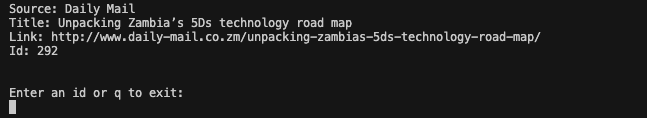

I made an api and didn't know how to use it.

#### Screenshots

The initial screen when you first run the app.



The screen after you specify an id.


This app uses the [watchman-api](https://watchman-api.herokuapp.com/api/v1/) to get the data.

#### Make Commands

To run the app, run:

```sh
make run
```

To intall the app, run:

```sh
make install
```

To build the app, run:

```sh
make build
```

#### Dependencies

[Go](https://golang.org/doc/install)
